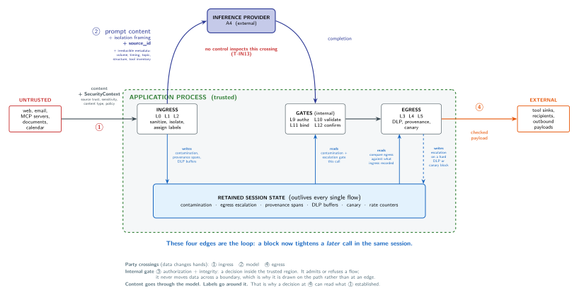

# GuardLLM Threat Model

<!-- nav:start -->
[Docs index](README.md)
<!-- nav:end -->

This document states the threats GuardLLM is designed to mitigate, the assumptions it makes about its environment, and the threats it explicitly does not mitigate. It complements `docs/security.md` (architecture) and `SECURITY.md` (reporting policy).

The aim is to be precise about *what GuardLLM is responsible for* so application authors can make informed decisions about what additional controls they still need.

## System Model

A GuardLLM-using application is, abstractly:

Source: [`diagrams/threat_model.tex`](diagrams/threat_model.tex). Rebuild with `pdflatex threat_model.tex && pdftocairo -svg threat_model.pdf threat_model.svg`.

The diagram answers one question the tables below cannot: **what crosses each boundary, and what does not.** Three things are worth reading off it:

- **Party crossings and internal gates are different kinds of thing.** Ingress, the model boundary, and egress are places where data changes hands. Authorization and integrity are decisions *inside* the trusted region: they admit or refuse a flow but never move data across a boundary, which is why they sit on the path rather than at an edge.
- **The model is a separate party.** Every byte of every prompt leaves the application process, and no control inspects that crossing (T-IN13). Metadata crosses with it and is irreducible: volume, timing, topic, structure, and the tool inventory remain visible regardless of what the payload contains.
- **The four edges on the session state are the loop.** Ingress writes labels; egress and the authorization gates read them; a high-confidence egress block writes escalation back. Because the gates read state that a *previous* cycle wrote, a block now tightens a later call in the same session. Content passes through the model; labels travel around it, which is why a decision at egress can still read what ingress established.

GuardLLM sits on the data path between untrusted external sources and trusted decision points (the model, tool invocation, outbound destinations). Decisions downstream of ingress can refer back to source trust, provenance, and detection results, but these come from two separate places rather than from one object travelling end to end:

- **Per-flow context** is a `SecurityContext` the host supplies on *every* call: mode, source type and id, source trust, principal trust, sensitivity, content type, and policy. It describes one flow. It is never inferred from content and is not retained between flows, because a single session commonly mixes flows: an operator instruction and a retrieved web page must not inherit each other's trust.
- **Per-session state** is what the pipeline derives and retains itself: contamination, egress escalation, provenance spans, DLP history, the remembered canary, and rate counters.

A downstream decision reads both. The [security context demo](../demo/guardllm_security_context_demo.html) runs one text through two sessions differing in a single declared field to show which of the two is doing the work.

## Trust Boundaries

GuardLLM enforces a label discipline across four boundaries:

1. **Ingress** - content enters from a typed source (`Guard.context_web`, `Guard.context_mcp_server`, etc.). The source determines initial `source_trust`. Content is sanitized, normalized, and wrapped in `<untrusted_content>` framing.
2. **Authorization** - a tool call is admitted only when a structured `AuthorizationEvent` matches policy. Untrusted-content-derived prompts cannot synthesize their own `AuthorizationEvent`.
3. **Integrity** - tool-call parameters are checked for consistency via `Guard.bind_request`. Verification recomputes the argument hash and compares it, the message hash, and the TTL against the recorded `Binding`, so any modification between binding and invocation is detected. This is an intra-process consistency check, not a cryptographic (keyed) binding: `Binding` objects are created and verified inside the trusted application process and are not designed to cross a trust boundary.
4. **Egress** - outbound payloads are checked against provenance and DLP policy. Content tagged untrusted at ingress is detected when it tries to reappear in an outbound message. *Scope limit:* "outbound payload" here means tool-call arguments and tool responses. Prompt content sent to an inference provider is a separate egress channel that no current control inspects; see T-IN13.

*Future work:* if `Binding` objects ever need to cross a process boundary, the Integrity check would need to become a keyed HMAC (or signature) over `(tool, args_hash, message_hash, created_at, ttl)` verified against a server-held secret. This is not implemented today because bindings stay within the trusted process (A-AS5).

## Deployment Shapes

GuardLLM runs in two shapes, and they differ in where the trust boundary falls.

**As a library, in process.** The host imports `Guard` and calls it. Everything above applies directly, and the assumptions A-AS1, A-AS2 and A-AS9 are host obligations because only the host knows which paths exist.

**As a gateway, as a proxy.** `guardllm.gateway` presents an OpenAI-compatible endpoint, so an application changes its `base_url` and makes no GuardLLM calls at all. That removes A-AS1, A-AS2 and A-AS9 as things the application can forget: a `tool` role message is ingested as untrusted content, the reply is checked on the way back, and neither is optional. Provenance is taken from the channel (message role, tool name) and never from content, so "nothing is inferred from content" survives the move into a proxy.

Three properties of that shape are worth stating because they are not obvious:

- **The gateway never holds an upstream key.** The client's `Authorization` header is forwarded verbatim and is never read, stored, or logged. A proxy that demanded its own provider key would be a different liability.
- **Session state is keyed by a client-supplied header.** `X-GuardLLM-Session` selects the session whose contamination, escalation and decision chain a request joins. Generated ids are `uuid4().hex`, but an id the gateway does not hold is honoured as the id of a *new* session, so the header is what identifies a session and nothing else does. See A-AS10.
- **The diagnostic endpoints are unauthenticated and enumerate sessions.** `GET /sessions` and `GET /forensics` list every live session id. The gateway ships no authentication of its own. See A-AS11.

The gateway is the single-instance tier: state is in memory, replicas do not share it, and streaming responses are not inspected incrementally.

## Adversaries

GuardLLM considers four adversary classes. A1, A2, and A3 are manipulation adversaries: they act on the application to make it do something. A4 is not, and the difference matters for what a control can look like.

### A1. Untrusted Content Author

Can write arbitrary bytes in any field of an external resource the application reads: a web page, an email body, a calendar invite, a document, an MCP-server tool response.

**Goals**: smuggle instructions to the LLM, exfiltrate prior conversation context, induce destructive tool calls, escape `<untrusted_content>` framing, evade detector heuristics.

**Capabilities**: full control over the byte stream they author; no privileged position in the application or network.

### A2. Compromised Tool / MCP Server

Can return arbitrary tool output, including outputs crafted to look like authorization grants, system messages, or trusted instructions.

**Goals**: as A1, plus replay attacks on previously-authorized actions, parameter tampering after binding, abuse of one tool's output as input to a more destructive tool.

**Capabilities**: full control over response bodies; cannot forge an `AuthorizationEvent` from the application's own authorization adapter.

### A3. Network-Position Attacker

Intercepts traffic between the application and external services.

**Goals**: replay stale tool-call payloads, swap parameters on in-flight calls.

**Capabilities**: read and rewrite traffic in flight, but cannot break TLS.

**What request binding does and does not cover here.** Binding is an
*intra-process consistency check*. A `Binding` is created and verified inside
the application process, which T-OUT2 already declares trusted, and
verification recomputes the canonical argument hash, matches the message hash,
and enforces the TTL. That catches arguments mutated between proposal and
dispatch, and a stale proposal replayed after its TTL, **before GuardLLM hands
the call to the transport**.

It does not cover what A3 does after that point. Once the checked call leaves
the process, an attacker who can rewrite traffic in flight can alter or replay
it, and no binding verification runs again on the way out. Transport integrity
is the host's obligation, which is what "cannot break TLS" is carrying. Do not
read binding as protection against replay performed downstream of the
pre-dispatch check.

### A4. Inference Provider

Receives every prompt the application sends and returns every completion. Applies when the model runs outside the application process, which is the common deployment.

**Goals**: none in the manipulation sense. A4 is honest-but-curious in the cryptographic meaning of the term: it follows the protocol and may learn from what it receives. That is an adversary model, not an exemption from one.

**Capabilities**: sees prompt and completion content in full, including the isolation framing and the `source_id` carried in it; may retain content indefinitely; may be compelled to disclose it; may operate subprocessors in other jurisdictions. Irreducible metadata crosses regardless of payload: request volume, timing, topic, structure, and the tool inventory. A4 cannot modify the application or forge an `AuthorizationEvent`.

**Why this is exfiltration, not a separate category.** Protected data reaching a third party is a confidentiality loss whether an attacker caused it or the design did. T-IN10 already treats leakage with no attacker behind it (internal detail in an exception message) as in scope, and nothing in the library conditions its egress checks on intent: `_scan_secrets` blocks a credential at egress without asking who put it there. What distinguishes A4 is not that it is benign. It is that the exfiltration rides the intended data path, so no anomaly exists for a detector to find, and the only available control is to not send the data. See T-IN13.

**Third-party exposure.** Even where A4 behaves exactly as contracted, retained prompts are a target for whoever breaches the provider and a source for whoever subpoenas it. The disclosure creates attack surface that outlives the request.

The application itself, the policy configuration, and the principal identity are **trusted**. GuardLLM does not defend against an attacker who can edit `PolicyConfig`, mint principal sessions, or run code in the application process.

## Threats In Scope (T-IN)

| ID    | Threat                                                                                   | Mitigation                                                |
|-------|------------------------------------------------------------------------------------------|-----------------------------------------------------------|
| T-IN1 | Direct prompt injection in untrusted content                                             | Sanitizer + isolation + heuristic detector                |
| T-IN2 | Indirect injection via hidden HTML/CSS / zero-width chars / homoglyphs                   | Normalization, hidden-element removal, TR39 confusables   |
| T-IN3 | Smuggling instructions via encoding (hex / base64 fragments)                             | Hex decode-then-scan in sanitizer                         |
| T-IN4 | Untrusted content synthesizing an `AuthorizationEvent`                                   | `AuthorizationEvent`s are structured objects the library never derives from content (it never parses natural language into an event); the policy engine validates the event's *contents* (action match, scope coverage with reverse check, message binding, TTL). Origin authenticity is a host obligation (see A-AS8) |
| T-IN5 | Destructive tool call from untrusted-trust principal                                     | Destructive tools are disabled by default. In **client mode** the policy engine additionally requires an `AuthorizationEvent` whose scope covers every dispatched argument. In **server mode** a destructive tool that is enabled and listed in `capability_scopes` is permitted without an authorization event: that is the server capability contract, and `server_default_deny=True` is the fail-closed opt-in when `capability_scopes` is unset. See the execution paths in [security.md](security.md). |
| T-IN6 | Parameter tampering between authorization and execution                                  | `Guard.bind_request` consistency check: verification recomputes the argument hash and rejects a mismatch against the recorded binding |
| T-IN7 | Replay of stale authorization or binding                                                 | TTL / anti-replay window checked in binding verification; policy-engine message binding (`PolicyConfig.require_message_binding`) denies an authorization whose message hash does not match the current message |
| T-IN8 | Untrusted-provenance content copied into outbound payload                                | `Guard.check_outbound` provenance + DLP (depends on A-AS9) |
| T-IN9 | Exfiltration via canary token                                                            | Trusted host places `Guard.canary_token` in private model context; the pipeline remembers it outside the model and gives its outbound match priority over generic DLP (depends on A-AS9) |
| T-IN10| Internal detail leakage via exception messages                                           | `Guard.sanitize_exception`                                |
| T-IN11| Detector evasion via low-cost obfuscation                                                | Multi-signal detector (composition penalty), normalization-before-detection |
| T-IN12| Empty allowlist treated as allow-all                                                     | Empty allowlist denies by default                         |
| T-IN13| Protected data exfiltrated to an external inference provider through the prompt itself   | **Partially mitigated, opt-in.** The de-identification layer this row once described as planned now exists: `Guard(..., privacy=PrivacyConfig(...))` replaces personal data with an opaque token before the prompt reaches the provider and restores the real value only where `restore_policy` and `destination_policy` both allow it, each deny-by-default. The limits are the point. It runs only when the host opts in and only over text the host passes to `deidentify`; it covers what declared values and deterministic patterns find, and reports `detection_incomplete` when it knows its own coverage was partial rather than implying it was total; and it does not infer, so a name in free text is reachable only through a seeded value or a registered `Detector`. Prompt content is still never passed to `check_outbound`, so L3/L4/L5 continue to have no jurisdiction over that channel and the Egress scope limit above is unchanged. What remains a host obligation is narrower than before: not "do not place protected data in prompts" but "declare what is protected, or accept what pattern detection reaches". See [privacy.md](privacy.md) |

## Threats Out of Scope (T-OUT)

| ID     | Threat                                                                              | Why out of scope                                                                 |
|--------|--------------------------------------------------------------------------------------|----------------------------------------------------------------------------------|
| T-OUT1 | Model not honoring `<untrusted_content>` framing                                     | Application layer choice; GuardLLM provides the framing, the application chooses to use it. Use stronger models or system-prompt discipline. |
| T-OUT2 | Compromise of the application process                                                | A1/A2/A3 do not include local code execution. If the attacker can edit policy, the game is over. |
| T-OUT3 | Misconfigured policy admitting a destructive tool to untrusted principals            | Operator responsibility; production checklist covers this.                       |
| T-OUT4 | Attacks requiring the network attacker to break TLS                                  | TLS is a layer below GuardLLM.                                                   |
| T-OUT5 | Side-channel timing attacks on the detector                                          | Heuristics are intentionally fast; we do not claim timing-side-channel resistance. |
| T-OUT6 | Adversarial perturbation of LLM weights (model supply-chain)                         | Layer above GuardLLM; use trusted model sources.                                 |
| T-OUT7 | Vulnerabilities in `beautifulsoup4`, `confusables`, or other runtime deps           | Tracked via Dependabot and pip-audit; CVEs fixed by upgrading, not patched in GuardLLM. |
| T-OUT8 | Detection of human-targeted social engineering not aimed at the model                | Not a content-injection threat.                                                  |
| T-OUT9 | Authentication and access control on the gateway's own HTTP surface                 | The gateway is designed to run inside the trust boundary of the application it serves, behind that deployment's existing authentication, and deliberately ships none of its own. Access control at the port is A-AS11. |

## Assumptions

GuardLLM relies on these assumptions. If any of them is violated, the corresponding mitigations may not hold.

| ID     | Assumption                                                                          | Failure mode if violated                                       |
|--------|--------------------------------------------------------------------------------------|----------------------------------------------------------------|
| A-AS1  | The application calls `process_inbound` before sending content to the model         | Sanitizer / detector never run; no protection                  |
| A-AS2  | The application calls `authorize` / `check_tool_call` before tool invocation        | Policy gate is bypassed                                        |
| A-AS3  | Source identifiers passed to `context_*` are honest about the actual source         | Trust labels are wrong; downstream decisions misroute          |
| A-AS4  | Policy config is authored and stored in a trusted location                          | Attacker who controls policy controls authorization            |
| A-AS5  | `Binding` objects are created and verified within the trusted application process and never cross a trust boundary | The `bind_request` consistency check does not defend against a party who can construct or modify a `Binding` (it is unkeyed); such a party would need in-process access, which is already out of scope per T-OUT2 |
| A-AS6  | Time clocks are roughly synchronized for anti-replay windows                        | Anti-replay rejects legitimate calls or admits stale ones      |
| A-AS7  | `<untrusted_content>` framing is preserved through to the model                     | Without framing the model sees untrusted text as system-level  |
| A-AS8  | Only trusted application adapters construct `AuthorizationEvent`s                    | An attacker who can mint `AuthorizationEvent`s in-process holds authorization authority; the library validates event contents, not origin |
| A-AS9  | The application calls `check_outbound` on every outbound channel it *can*, including the content carried in tool-call arguments, and enforces a block. **Scope:** this covers tool-call arguments, tool responses, and outbound payloads. It does not cover the prompt sent to an inference provider, which is a channel `check_outbound` is not called on and could not usefully be called on, since blocking it would block the request itself. That gap is T-IN13, not an instance of this assumption being violated | Egress DLP, provenance, and canary checks never run on that channel, so untrusted or sensitive content leaves uninspected. `check_tool_call` gates the *action* (policy, rate limit, binding) and does not inspect argument content: gating a send does not inspect what is sent. A missed high-confidence DLP or canary block also means egress-feedback escalation never fires, so subsequent tool calls are not tightened |
| A-AS10 | **Gateway only.** `X-GuardLLM-Session` is treated as a bearer credential by the client and by any intermediary that can see it | A party holding a session id joins that session: it inherits the session's contamination and escalation state, contributes decisions to its chain, and can read that chain through `GET /sessions/<id>`, `GET /forensics/<id>` and `GET /support/<id>`. Joining a contaminated session only ever tightens what the joiner may do, so this is a disclosure and interference risk rather than a way to escape enforcement |
| A-AS11 | **Gateway only.** The gateway's HTTP port is reachable only by the applications it serves | The gateway ships no authentication. `GET /sessions` and `GET /forensics` list every live session id, so a party that can reach the port can enumerate sessions rather than having to guess a `uuid4`, and then read or join any of them per A-AS10. Put the port behind whatever authentication the deployment already runs; do not publish it |

## Defense-in-Depth Reminder

GuardLLM materially reduces risk in T-IN1 through T-IN12. It does not eliminate it. Applications should also have:

- Strong authentication and authorization for principals
- Network and runtime isolation between tools
- Secret management with rotation
- Monitoring and incident response that consumes GuardLLM's audit events
- Rate limiting at the request layer (not only inside GuardLLM)

The benchmark numbers in `benchmarks/results.md` are GuardLLM's measured effectiveness on the documented suites; they are not a guarantee against novel attack classes that emerge after release.

## Updating This Document

When you add a new mitigation, add a row to T-IN. When you remove or change an assumption, update A-AS. When you adopt a new external dependency that introduces a new trust boundary, update the system model diagram.
